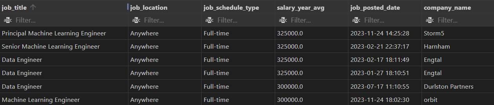
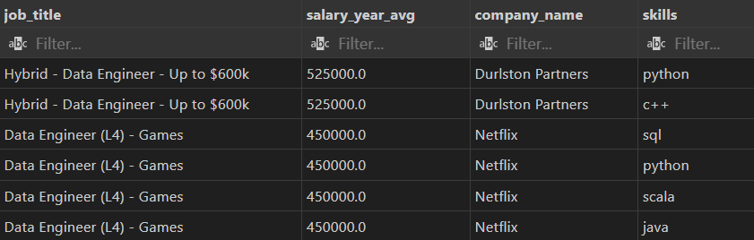
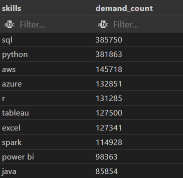
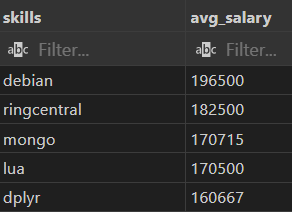
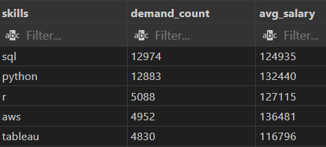

# SQL Practice

SQL practice to upskill as a Game Developer

## Introduction

I wanted to learn SQL to upskill into potential backend or data analyst roles. Watched [this video](https://www.youtube.com/watch?v=7mz73uXD9DA), but changed a little to not just follow-along.

Before starting this project, I did a couple other tutorials to understand how SQL is formated and used and to learn the syntax. I wanted to have a visible project so it didn't seem like all I was doing was learning was to answer Leetcode SQL questions.

## What is this project?

The project uses SQL to search through CSV files to find the highest paying jobs and popular skills. The dataset is probably old, but seems truthful enough.

I was able to understand how SQL is used in a more real-world sense. Find the [SQL files here](/project_sql/).

## Tools Used

1. **SQL**: The main goal
2. **PostgreSQL**: Database management system

## Questions answered

1. What are the top-paying "Engineer" jobs?

   

2. What skills are required for top paying "Engineer" roles?

   

3. What are the most in-demand skills?

```sql
/* Only code shown because it is the smallest */
SELECT skills,
    COUNT(skills_job_dim.job_id) AS demand_count
FROM job_postings_fact
    INNER JOIN skills_job_dim ON job_postings_fact.job_id = skills_job_dim.job_id
    INNER JOIN skills_dim ON skills_job_dim.skill_id = skills_dim.skill_id
GROUP BY skills
ORDER BY demand_count DESC
LIMIT 10;
```



4. What are the top-skills based on salary?

   

5. What are the most optimal skills (high-demand & salary)?

   

## What I Learned

I learned that the "WITH" statement makes temporary sets (Very helpful) so you can combine them to search for something.
SQL is a lot more and a lot less than I thought. Real-job examples are probably bigger, but I can do a lot with 10 lines.

I do like SQL. It reads easy and makes sense when you look at it (90% of the time).
